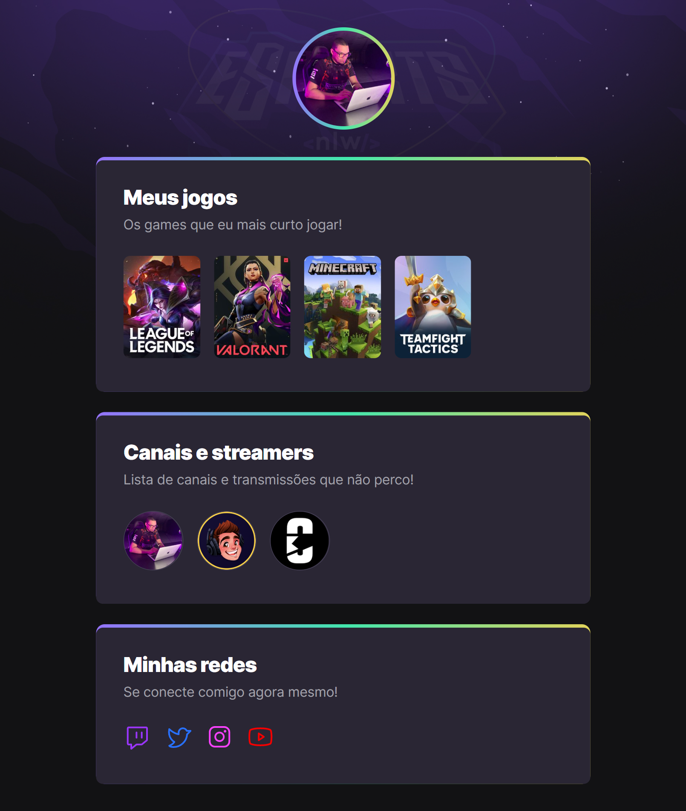

# NLW eSports

## Projeto 💻
Projeto desenvolvido durante a NLW eSports da Rocketseat na Trilha Explorer.

## Layout 🔖
Segue abaixo o layout deste projeto:
- [Figma](https://www.figma.com/file/W6q6TmYWyTcxZYHfZ37YDB/NLW-eSports-(Community))

## Instalação 🛠
Siga esses passos para instalar o repositório na sua máquina:
1. Rode `git clone https://github.com/miishiyama/NLW-eSports` para fazer um clone desse repositório.
2. Abra o arquivo HTML.

## Tecnologias 🚀
As tecnologias utilizadas neste projeto são:
- HTML
- CSS
- Keyframes
- Google Fonts

## Créditos ❤️
Feito por [Millene Eduarda Ishiyama](https://github.com/miishiyama/).
